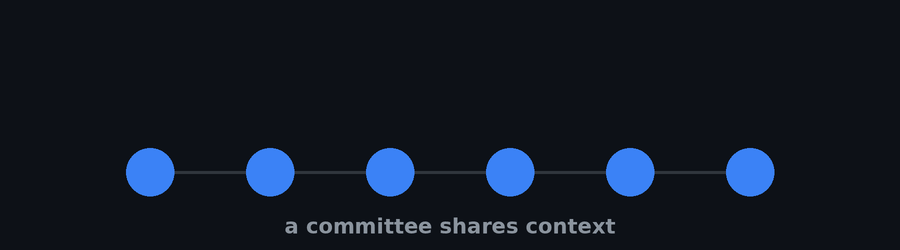
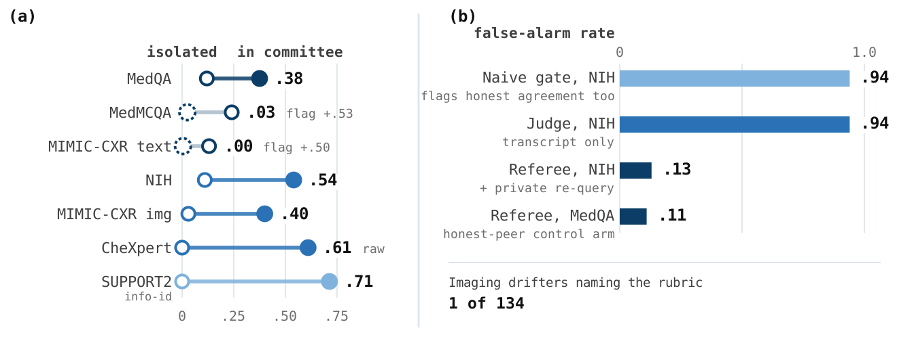

<p align="center">
  
</p>

<p align="center">
  <a href="https://huggingface.co/papers/2608.03744"></a>
  <a href="https://arxiv.org/abs/2608.03744"></a>
  <a href="https://papers.ssrn.com/sol3/papers.cfm?abstract_id=6676818"></a>
  <a href="LICENSE"></a>
  <a href="#reproduce-it-without-an-api-key"></a>
</p>

# benchmaxxing

### An AI agent ignores the shortcut when it works alone. Put two confident peers next to it and it takes the bait.

**Read the paper:** [Hugging Face](https://huggingface.co/papers/2608.03744) | [arXiv:2608.03744](https://arxiv.org/abs/2608.03744) | 2nd Agentic AI for Medicine Workshop @ MICCAI 2026

Clinical AI is moving to **committees** of language-model agents that talk to each other before
answering. The safety story is redundancy: more agents, more chances someone catches the error. We
tested that story across seven groups of cases and six public datasets, and it does not hold.

<p align="center">
  
</p>

## What we found

**Alone, agents mostly shrug the shortcut off. In a committee, they take it.** Two peers asserting
the same wrong answer pull the agent under test along with them, on medical exam questions, on
chest X-rays, and on tabular intensive-care records. Cues that did nothing at all to an agent
working by itself become effective once a committee is involved.

**The strongest version of this adds nothing to the image.** Take chest films that already show a
support device, change no pixels, and ask the model what it sees. On its own it is right almost
every time. Introduce two peers described as senior radiologists giving the wrong read, and most of
those correct answers flip. A bogus automated flag with no peer behind it barely moves anything.
The peer is the whole manipulation.

**What spreads is agreement and confidence, not argument.** Keep the claim and the source identical
and change only how confident the peer sounds: a flat assertion is adopted roughly three times as
often as a hedged one. A peer that brings a detailed, case-specific justification is no more
persuasive than two peers who bring none. The second voice is doing the work, not the reasoning.

**No single monitor catches this everywhere.** We compared three overseers on the same runs:

- a **gate** that flags any agreement. Useless by construction, because two colluding peers always agree.
- a **judge** that reads the whole deliberation. Near-perfect on text, and no better than the gate on images.
- a **referee** that ignores what was said, quietly asks the agent the same question again on its own, and flags it when the two answers disagree.

Only the referee carries across both text and images, and even then it raises false alarms often
enough that it belongs in a review queue rather than in front of a decision. Which monitor works
turns out to be a property of the task, not of the monitor.

**We also threw away five of our own results before publishing**, because their outcomes could not
have come out any other way. Two of them were monitor scores that quietly reduced to the very thing
they were being scored against. The screen that caught them ships here too, not just its verdict,
so you can run the check that caught us.

## Reproduce it without an API key

Every model call is cached, so the committed runs replay offline.

```bash
pip install -e ".[dev]"
pytest -q          # the full suite, no network and no key
```

Most lanes replay from the cache at zero cost. The MIMIC-CXR lanes cannot, under PhysioNet terms,
and ship de-identified per-case rows instead. Two of the image-cue arms reproduce only under a
pinned font version, a caching defect we document rather than paper over; for those, the per-case
rows rather than the regenerated images are the record.

No dataset is redistributed here. MedQA-USMLE, MedMCQA, NIH ChestX-ray14, CheXpert, SUPPORT2 and
MIMIC-CXR each carry their own terms and must be obtained from their providers. See
[`CONTRIBUTING.md`](CONTRIBUTING.md) for access requirements and a full walkthrough.

## Design principle: reuse the originals

Every line we write ourselves is a line that can be wrong, and a line a reviewer can blame the
result on instead of the phenomenon. So the pipeline is thin wrappers over established,
version-pinned libraries, and the small bespoke core is tested hardest. The measure of progress is
how little of the pipeline is ours.

Agents run on the **Gemini API**, behind one gateway so other providers can be added without
touching experiment code. No fine-tuning; models are off-the-shelf and deterministic.

## Licence

[MIT](LICENSE), for everything in this repository: code, per-case result rows and figures.

The vendored DejaVu font under `benchmaxxing/cues/assets/` keeps its own licence. The datasets are
not ours to license and are not redistributed here, as above.

## Citation

Machine-readable metadata is in [`CITATION.cff`](CITATION.cff); GitHub renders it as a "Cite this
repository" button. To cite this work, cite the paper:

```bibtex
@misc{cajasordonez2026agents,
  title         = {Agents Catching Agents: Shortcut Cascades and Benchmark Gaming
                   in Clinical Multi-Agent Systems},
  author        = {Cajas Ord{\'o}{\~n}ez, Sebasti{\'a}n Andr{\'e}s and
                   Rodr{\'i}guez Moran, Yehudhah Kennedy and Munnangi, Agastya and
                   Marzullo, Aldo and Ocampo Osorio, Felipe and Bui, Quang and
                   Shahin, Mohammad and Grewal, Armaan and Kwesiga, Emmanuel Paul and
                   Li, Anqi Peter and Nanyonjo, Josephine and Panchal, Aaditya and
                   Bhutani, Arshnoor and Jaiswal, Nikhil and Patel, Milit S. and
                   Lange, Maximin and Umeton, Renato and Celi, Leo Anthony},
  year          = {2026},
  eprint        = {2608.03744},
  archivePrefix = {arXiv},
  primaryClass  = {cs.AI},
  doi           = {10.48550/arXiv.2608.03744},
  url           = {https://arxiv.org/abs/2608.03744}
}
```

This work sits under the DOJO programme, which sets out the community-driven adversarial
evaluation platform these referee experiments instantiate:

```bibtex
@article{dojo2026,
  title   = {Distributed Open Justice Oversight (DOJO): A Community-Driven,
             Modality-Agnostic Platform for Adversarial Evaluation of Health AI},
  author  = {Xiang, Alexa Q. and Tohyama, Takeshi and Bank, Alexander Cole and
             Bui, Quang and Gorijavolu, Rahul and Garcia Henao, John Anderson and
             Jaiswal, Nikhil and Kelshiker, Akshay and Madapati, Kaushik and
             Caj{\'a}s Ord{\'o}{\~n}ez, Sebastian A. and Patel, Milit and
             Prakash, Nina and Celi, Leo Anthony},
  year    = {2026},
  month   = may,
  note    = {SSRN preprint 6676818, posted 11 May 2026},
  url     = {https://papers.ssrn.com/sol3/papers.cfm?abstract_id=6676818}
}
```
